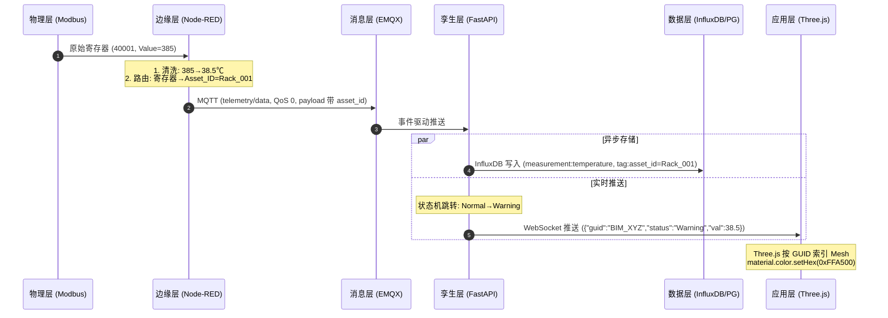
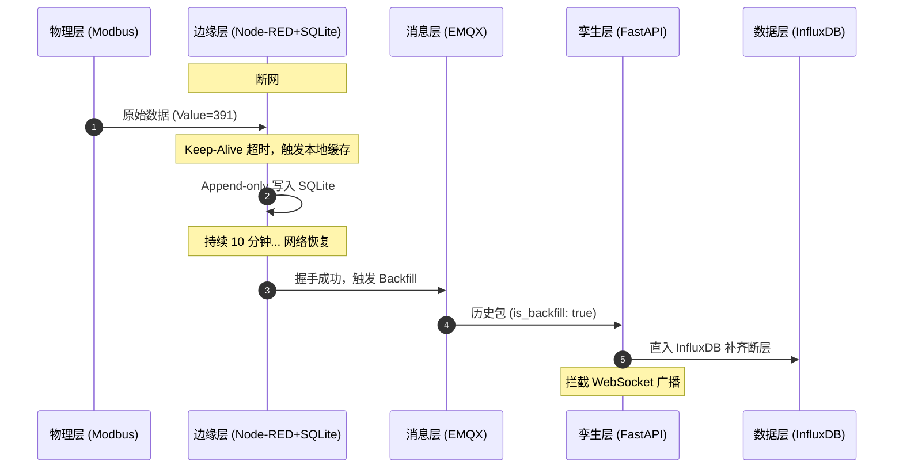

# 🏗️ Architecture Design Records (ADR) — 工业级数字孪生平台

> 本文件阐明系统架构、分层设计推导、核心数据流演进以及高性能并发下的设计决策。
> **设计目标：** 解耦、资产导向、事件驱动。

---

## 1. 总体架构拓扑

```
========================================================================================
[1. 应用层 Application]    Three.js / IFC.js WebBIM ──→ 状态大屏 ──→ 历史回放轴
                               ▲ (WebSocket 实时状态流 / 事件触发)
===============================│========================================================
[2. 孪生层 Twin Layer]     Twin Service (FastAPI) ──→ 资产状态机矩阵 ──→ 统一数据路由
                               ▲                          ▲
                               │ (数据联邦查询)            │ (事件总线订阅)
===============================│==========================│=============================
[3. 数据层 Data Layer]     PostgreSQL (资产/测点)    InfluxDB (时序/降采样)
===============================│==========================│=============================
[4. 消息层 Message Layer]      EMQX Broker (MQTT QoS 0/2 / 发布订阅解耦)
                               ▲
                               │ (标准化 JSON 报文: telemetry & event)
===============================│========================================================
[5. 边缘层 Edge Layer]     Node-RED (采集 ──→ 清洗 ──→ 窗口平滑 ──→ 断网缓存)
                               ▲
                               │ (Modbus TCP 原始工业寄存器)
===============================│========================================================
[6. 物理层 Physical]       Modbus Simulator (PLC / 智能电表 / 传感器)
========================================================================================
```

---

## 2. 分层架构推导与设计博弈

### 2.1 边缘层 — 解决物理信号非标性与网络不可靠性

**物理本质：** 工业传感器的电磁噪声 + 网络不可靠导致的高频摩擦。

**为什么滑动窗口？**
工业温度传感器在电磁噪声环境下存在瞬时毛刺。若将跳变直报云端，会引发告警风暴。
→ 边缘端引入 10 秒滑动窗口求均值，平滑掉瞬时误差。

**断网自愈（Store and Forward）：**
- 本地挂载 SQLite 作为高速 Buffer
- 断网时边缘规则引擎继续运转，维持本地闭环安全
- 数据以 Append-only 写入 SQLite
- **核心博弈：** 恢复后补发（Backfill）不能冲垮前端。补发报文打 `is_backfill: true` 标签，Twin Service 识别后直入 InfluxDB 归档，**不对 WebSocket 广播**，守住前端平滑性。

### 2.2 消息层 — 消除海量设备并发的耦合墙

**为什么 MQTT 而非 HTTP？**
HTTP 是强耦合请求-响应模式，高频并发下会死锁。MQTT 的发布-订阅实现了物理层与数据层的**空间解耦、时间解耦、架构解耦**。

**QoS 分级策略：**

| 数据类型 | Topic | QoS | 理由 |
|---|---|---|---|
| 遥测（温度、湿度） | telemetry/data | 0 | 允许极小概率丢包，换取高吞吐 |
| 告警（阈值、故障） | event/alarm | 2 | 四步握手机制，Exactly Once，严防二次误操作 |
| 控制指令 | command/* | 2 | 同上 |

### 2.3 数据层双轨制 — 静态属性与动态时间流天然分离

**物理本质：** 资产的"属性静态性"与时间维度的"流变连续性"天然不可共存于同一存储引擎。

**为什么必须解耦？**
用 PostgreSQL 存每秒温度 → `UPDATE` 丢失历史轨迹，`INSERT` 流水账导致 B+ 树对数级膨胀，写入瘫痪。

→ 双轨制：

| 数据库 | 存储对象 | 操作模式 | 核心优势 |
|---|---|---|---|
| PostgreSQL | 资产拓扑（机柜→传感器关系） | CRUD + JOIN | 强一致性，空间实体表达 |
| InfluxDB | 时序数据（时间戳 + asset_id + value） | Append-only | 只追加不修改，写入吞吐量高 3个数量级 |

**红线：** sensor_id / register_id 绝不传到前端。前端只认 `BIM_GUID`。

### 2.4 孪生层 — 为什么不能 Three.js 直连数据库？

**直连数据库是低级玩具架构的代表。**

前端 3D 视口旋转放大时需要高频获取大批物体的复合状态。直连时序数据库意味着前端轮询，会把数据库并发读冲垮。

**Twin Service 作为数据联邦与状态聚合器：**
- 常驻内存维护 **资产五状态机矩阵**（Normal / Warning / Alarm / Maintenance / Offline）
- 前端初始化：`GET /twin/snapshot` 一次轻量获取全场快照
- 后续状态变更：统一走 WebSocket 主动推送，**彻底卸载数据库并发读压力**

---

## 3. 核心时序数据流

### 3.1 正常流：物理信号 → 3D 渲染

全程无硬编码、无硬绑定。



### 3.2 异常流：断网自愈（Store and Forward）



---

## 4. 工业级数据降采样策略与量化收益

高频数据 7 天保留 → 1 小时窗口中位数聚合 → 永久保留：

```
[实时层] ──7天──→ [1h 中位数聚合] ──永久──→ [历史层]
```

```sql
CREATE TASK downsampling_1h
EVERY 1h
BEGIN
    SELECT mean("value") AS "value", max("value") AS "max_value"
    INTO "dt"."long_term"."temperature"
    FROM "dt"."real_time"."temperature"
    WHERE time > now() - 1h
    GROUP BY time(1h), "asset_id"
END
```

### 架构收益量化

| 指标 | 全量原始存储 | 本系统降采样 | 收益 |
|---|---|---|---|
| 单设备年存储 | ~253 MB | ~5 MB | 降低 98% |
| 1月历史查询基数 | 2,592,000 条 | 720 条 | 提升 3600 倍 |
| 历史回放加载耗时 | ~12 s（浏览器假死） | ~35 ms（即时响应） | 降低 99.7% |

---

## 5. 系统高压红线

| # | 红线 | 错误做法 | 正确做法 |
|---|---|---|---|
| 1 | 前端硬件非标隔离 | 传 `sensor_id` / `register_id` 到前端 | 前端只认 `BIM_GUID`，非标转换在边缘层消灭 |
| 2 | 时序高基数灾难 | 将 `UUID` / `时间戳` 作为 InfluxDB Tag | Tag 限低基数维度：`asset_id`, `room_id` |
| 3 | 单向依赖链 | Node-RED 直写 InfluxDB / Three.js 直连 PG | `Application → Twin → Data`，底层严禁反向注入上层逻辑 |

---

## 6. MQTT Topic 规范

| Prefix | 用途 | QoS |
|---|---|---|
| `dt/telemetry/{asset_id}` | 传感器遥测 | 0 |
| `dt/alarm/{asset_id}` | 告警事件 | 2 |
| `dt/command/{asset_id}` | 控制指令 | 2 |
| `dt/status/{device_id}` | 设备心跳 | 0 |

---

## 7. 资产五状态机

| 状态 | 颜色 | 触发条件 |
|---|---|---|
| Normal | 绿 | 数据在正常范围 |
| Warning | 黄 | 达到阈值 80% |
| Alarm | 红 | 超过阈值 |
| Maintenance | 橙闪烁 | AI 预测即将故障 |
| Offline | 灰 | 心跳丢失 |

---

## 8. 扩展接口

| 扩展 | 接入层 | 用途 |
|---|---|---|
| OPC UA | Edge | 工业设备统一接入 |
| BACnet | Edge | 楼宇自控接入 |
| Kafka | Message | 高吞吐事件总线 |
| Redis | Twin/Data | 缓存 / 实时状态 |
| Grafana | Data | 可视化面板 |
| AI Agent | AI | 异常检测 / 趋势预测 |

---

## 9. 项目结构

```
project/
├── README.md              # 项目引入（做什么）
├── Architecture.md        # 架构机理（怎么做） ← 本文
├── ROADMAP.md             # 演进路径（何时做）
├── AGENTS.md              # AI 约束（禁止什么）
├── Dockerfile / docker-compose.yml
├── edge/NodeRED/          # 边缘层
├── backend/FastAPI/       # 孪生层
├── frontend/threejs/      # 应用层
├── database/postgres/     # 数据层
├── simulation/modbus/     # 物理层
├── ai/                    # AI 层（Phase 4）
├── ifc/                   # BIM 模型
└── tests/
```

---

## 10. 安全约束

| 条目 | 规则 |
|---|---|
| Edge 层 | 不得暴露公网 |
| MQTT | 用户名密码认证，TLS 加密 |
| API | JWT 认证 |
| 数据库 | 端口仅对内网容器开放 |
